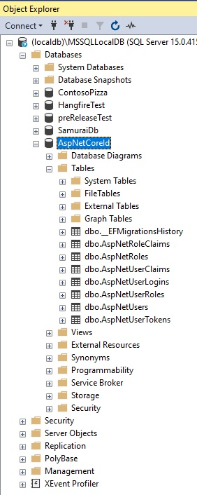

# Web App Aspdotnet core identity.

- Add nuget packages
  ```xml
  <ItemGroup>
    <PackageReference Include="Microsoft.AspNetCore.Authentication.Google" Version="6.0.10" />
    <PackageReference Include="Microsoft.AspNetCore.Identity.EntityFrameworkCore" Version="6.0.10" />
    <PackageReference Include="Microsoft.EntityFrameworkCore.SqlServer" Version="6.0.10" />
    <PackageReference Include="Microsoft.EntityFrameworkCore.Tools" Version="6.0.10">
      <PrivateAssets>all</PrivateAssets>
      <IncludeAssets>runtime; build; native; contentfiles; analyzers; buildtransitive</IncludeAssets>
    </PackageReference>
  </ItemGroup> 
  ```
- Add the following db context class in the Data folder
  ```cs
  public class AppDbContext : IdentityDbContext
  {
      public AppDbContext(DbContextOptions<AppDbContext> options) : base(options)
      {
      }
  }
  ```  
- Configure the services to let the container know about the db context.

  ```cs
  builder.Services.AddDbContext<AppDbContext>(options =>
  {
      options.UseSqlServer(builder.Configuration.GetConnectionString("Default"));
  });
  ```
- Add a connection string setting to app settings file.
  ```json
  "ConnectionStrings": {
    "Default": "Data Source=(localdb)\\MSSQLLocalDB;Initial Catalog=AspNetCoreId;Integrated Security=True"
  }
  ```

- Using SSMS create a new database of name AspNetCoreId

- Now run the add migration command. Then update command.
  ```ps
  dotnet ef migrations add InitialMigration

  dotnet ef database update InitialMigration
  ```
- Inspect the database for the tables created.



- Add a new model called AppUser as follows.
  ```cs
  public class AppUser : IdentityUser {  }
  ```
- Add Id Service. 
  ```cs
  builder.Services.AddIdentity<AppUser, IdentityRole>().AddEntityFrameworkStores<AppDbContext>().AddDefaultTokenProviders();
  ```
- 

